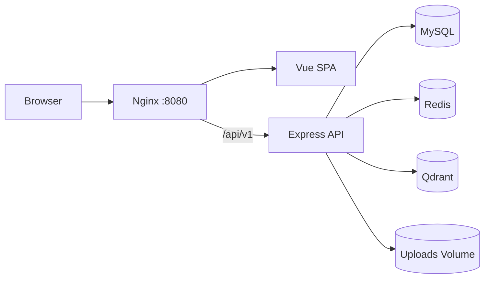

# Personal Blog

一个面向个人写作与知识沉淀的全栈博客系统。项目采用 Vue 3 + Express + MySQL 的前后端分离架构，并在传统博客能力之外加入 Redis 缓存、Qdrant 语义检索、RAG 问答雏形、后台统计与 Docker Compose 部署。

## 功能特性

- 博客首页、文章详情、归档页、关于页
- 管理后台登录、文章管理、评论审核、图片上传
- Markdown 编辑与渲染
- 文章点赞、阅读统计、评论状态管理
- Redis 缓存文章、元数据与统计接口
- Qdrant 语义搜索与文章切片索引
- 文章 AI 摘要、标签建议、相似文章推荐
- RAG 问答接口雏形
- TraceId 链路追踪与统一响应结构
- Docker Compose 一键部署，支持数据库迁移服务

## 技术栈

### 前端

- Vue 3
- Vite
- TypeScript
- Vue Router
- Pinia
- Axios
- Tailwind CSS
- md-editor-v3
- marked + DOMPurify
- ECharts / vue-echarts

### 后端

- Node.js
- Express
- TypeScript
- MySQL 8
- Redis
- Qdrant
- JWT + Refresh Token + HttpOnly Cookie
- multer
- Docker / Docker Compose

## 项目结构

```text
.
├─ blog-frontend/          # Vue 3 前端应用
├─ blog-backend/           # Express + TypeScript 后端 API
├─ database/
│  ├─ init.sql             # 新数据库初始化脚本
│  └─ migrations/          # 现有数据库卷升级迁移脚本
├─ nginx/                  # Nginx 静态托管和 API 反向代理
├─ docker-compose.yml      # 生产/部署编排
├─ .env.production.example # 生产环境变量模板
└─ 部署说明.md             # 部署与运维说明
```

## 架构概览



后端采用模块化单体结构：

- `routes`：API 路由入口
- `controllers`：HTTP 参数读取与响应返回
- `modules/*/service.ts`：业务逻辑
- `modules/*/repository.ts`：数据库访问
- `shared`：认证、缓存、错误处理、日志、RAG、工具函数

## 本地开发

### 1. 安装依赖

```bash
cd blog-backend
npm install

cd ../blog-frontend
npm install
```

### 2. 准备环境变量

后端本地开发可使用 `blog-backend/.env`。生产部署使用仓库根目录的 `.env.production`：

```bash
cp .env.production.example .env.production
```

请修改其中的数据库密码、JWT 密钥和 CORS 域名。

### 3. 启动开发服务

后端：

```bash
cd blog-backend
npm run dev
```

前端：

```bash
cd blog-frontend
npm run dev
```

前端开发服务会通过 Vite proxy 转发 `/api` 到本地后端。

## Docker 部署

生产环境推荐使用 Docker Compose：

```bash
docker compose --env-file .env.production up -d --build
```

查看状态：

```bash
docker compose --env-file .env.production ps
```

查看日志：

```bash
docker compose --env-file .env.production logs -f backend
docker compose --env-file .env.production logs -f nginx
docker compose --env-file .env.production logs -f migrate
```

服务默认通过宿主机 `8080` 端口访问：

```text
http://localhost:8080
```

MySQL、Redis、Qdrant 不映射到宿主机端口，只在 Docker 内部网络中访问，适合公网部署。

## 数据库迁移

`database/init.sql` 只会在 MySQL 数据卷首次创建时自动执行。对于已经存在的数据卷，项目提供了 `migrate` 服务自动执行：

```text
database/migrations/*.sql
```

每次执行：

```bash
docker compose --env-file .env.production up -d --build
```

都会先等待 MySQL 健康，再运行迁移脚本，最后启动后端服务。迁移脚本应保持可重复执行。

## 语义检索与索引

语义检索依赖 Qdrant。重新构建文章索引需要管理员登录后调用后台接口：

```text
POST /api/v1/admin/search/reindex
```

公开搜索接口：

```text
GET /api/v1/search?q=关键词&limit=6
```

为了安全，索引重建接口不暴露在公开 API 下。

## 安全说明

- 不要提交 `.env.production`，仓库只保留 `.env.production.example`
- 部署到公网前请替换强密码和强 JWT 密钥
- MySQL、Redis、Qdrant 不应直接暴露到公网
- 后台接口依赖 Bearer access token 和 HttpOnly refresh token
- Nginx 已配置基础安全响应头
- 上传接口限制为 JPG、PNG、WebP、GIF 图片

如果真实密钥曾经提交到远端仓库，请立即轮换相关密码和密钥。

## 常用命令

构建后端：

```bash
cd blog-backend
npm run build
```

构建前端：

```bash
cd blog-frontend
npm run build
```

检查后端依赖漏洞：

```bash
cd blog-backend
npm audit --audit-level=moderate
```

停止服务：

```bash
docker compose --env-file .env.production down
```

清空数据卷，慎用：

```bash
docker compose --env-file .env.production down -v
```

## 部署文档

更完整的公网部署、Cloudflare 端口规则、服务器运维命令见：

[部署说明.md](./部署说明.md)
